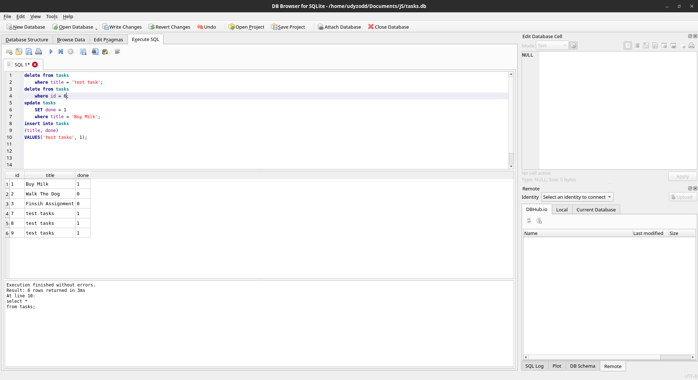

# Task API

A simple in-memory CRUD API for managing a to-do list, built with Node.js and Express as part of the FlyRank Backend Internship (Week 2, Assignment A1). Supports full Create, Read, Update, and Delete operations on tasks, with interactive API docs via Swagger UI.

## Install & Run

```bash
npm install && node main.js
```

The server starts on `http://localhost:3000`.

## Endpoints

| Method | Path         | Description             |
| ------ | ------------ | ----------------------- |
| GET    | `/`          | API info                |
| GET    | `/health`    | Health check            |
| GET    | `/tasks`     | List all tasks          |
| GET    | `/tasks/:id` | Get a single task by id |
| POST   | `/tasks`     | Create a new task       |
| PUT    | `/tasks/:id` | Update a task by id     |
| DELETE | `/tasks/:id` | Delete a task by id     |

## Example Request

```bash
curl -i http://localhost:3000/tasks
```

## Swagger UI

Interactive API docs are available at `http://localhost:3000/docs` once the server is running. Every endpoint can be tested directly from the page via "Try it out."

## Status Codes

| Code | Meaning                    |
| ---- | -------------------------- |
| 200  | Successful read/update     |
| 201  | Task created               |
| 204  | Task deleted               |
| 400  | Invalid or missing `title` |
| 404  | Task not found             |

## Database

Tasks are stored in a SQLite database (`tasks.db`), not in memory.

**Why SQLite?** It's a single file with no separate server to install or configure — perfect for a small project like this. Unlike Assignment 1's in-memory storage, data now survives a server restart.

**Where it lives:** `tasks.db` is created automatically the first time the app runs. It's git-ignored, so every fresh clone starts with a clean database — the app seeds 3 example tasks on first run only.

**One example query (from Stage 4):**

```sql
SELECT COUNT(*) FROM tasks;
```

Returned `4` — confirming the 3 seeded tasks plus one I'd created via `POST` were all persisted correctly.

- `title` is required on both create (`POST`) and update (`PUT`); a missing or empty title returns `400`.

- All queries use parameterized placeholders (`?`) to prevent SQL injection.
  
  ## Working Screenshot


## Database Screenshot

