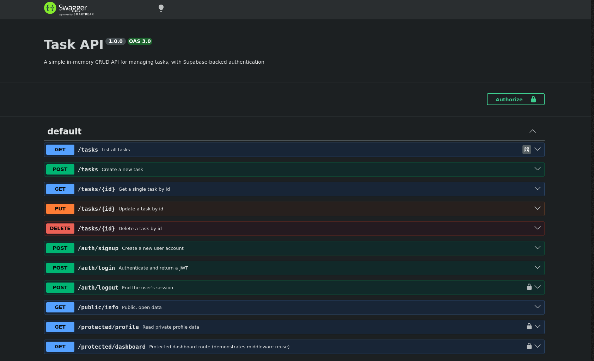
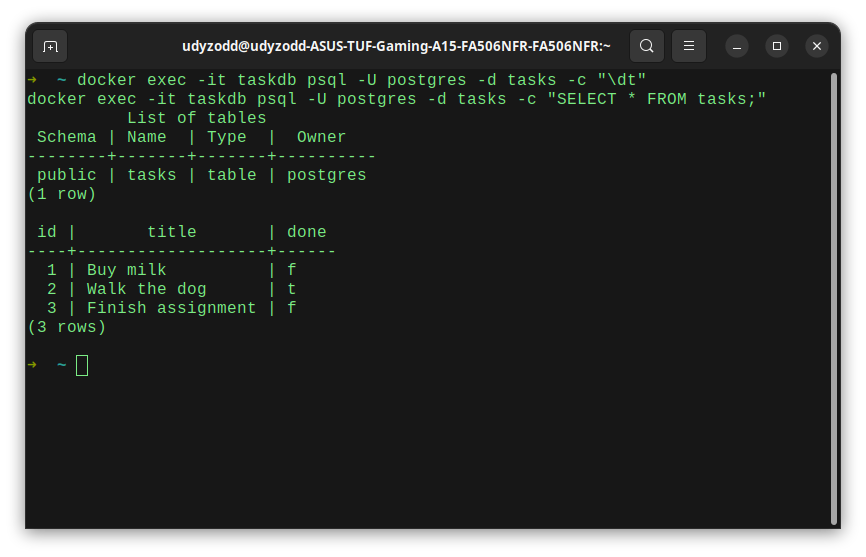

# Task CRUD API

A task management REST API built across four assignments:

- **Version 1** — in-memory storage (Express)
- **Version 2** — SQLite file storage
- **Version 3** — containerized PostgreSQL, with the whole stack (app + database)
  started using a single `docker compose up`
- **Version 4 (this)** — Supabase Auth added on top: sign up, log in, log out,
  and protected routes guarded by JWT verification

The core task API never changed across all four — only the storage underneath,
and now an authentication layer sitting alongside it.

## Run it

**Option A — everything in Docker (recommended for a quick clone-and-run):**

```bash
git clone https://github.com/udyzodd/task-crud-api.git
cd task-crud-api
cp .env.example .env
# fill in your own SUPABASE_URL and SUPABASE_KEY in .env — see below
docker compose up
```

**Option B — Postgres in Docker, API on your host (useful for active development):**

```bash
docker compose up -d db
node main.js
```

The API is available at `http://localhost:3000` either way. Swagger docs are at
`http://localhost:3000/docs`.

## Environment variables

See `.env.example` for the required keys. Copy it to `.env` before running:

```
DATABASE_URL=postgres://postgres:dev@db:5432/tasks
SUPABASE_URL=your_supabase_project_url
SUPABASE_KEY=your_supabase_anon_key
PORT=3000
```

- `DATABASE_URL` — points to `db` (the Docker service name) if running via
  `docker compose up`; use `localhost` instead if running `node main.js` directly
  on your host with only the `db` container up (Option B above).
- `SUPABASE_URL` / `SUPABASE_KEY` — from your own Supabase project's
  **Project Settings → API** page. Use the **anon / publishable** key — never the
  `service_role` / secret key here.

`.env` is git-ignored and never committed — only `.env.example` (with placeholder
values) is tracked. No Supabase keys appear anywhere in this repo's git history.

## Endpoints

| Method | Path | Description | Auth required | Success | Errors |
| --- | --- | --- | --- | --- | --- |
| GET | /tasks | List all tasks | No | 200 | — |
| GET | /tasks/:id | Get a single task | No | 200 | 404 |
| POST | /tasks | Create a task | No | 201 | 400 |
| PUT | /tasks/:id | Update a task | No | 200 | 400, 404 |
| DELETE | /tasks/:id | Delete a task | No | 204 | 404 |
| POST | /auth/signup | Create a new user account | No | 201 | 400 |
| POST | /auth/login | Authenticate & return a JWT | No | 200 | 400, 401 |
| POST | /auth/logout | End the user's session | Yes (Bearer) | 204 | 401 |
| GET | /public/info | Public, open data | No | 200 | — |
| GET | /protected/profile | Read private profile data | Yes (Bearer) | 200 | 401 |
| GET | /protected/dashboard | Protected dashboard (demonstrates middleware reuse) | Yes (Bearer) | 200 | 401 |

Protected routes expect `Authorization: Bearer <access_token>`, where the token
comes from `POST /auth/login`. Tokens are verified against Supabase on every
request via a shared `authGuard` middleware — no auth logic is duplicated
across routes.

## Example

```bash
curl -i http://localhost:3000/tasks
```

```
HTTP/1.1 200 OK
Content-Type: application/json; charset=utf-8

[{"id":1,"title":"Buy milk","done":false},{"id":2,"title":"Walk the dog","done":true},{"id":3,"title":"Finish assignment","done":false}]
```

```bash
curl -i -X POST http://localhost:3000/auth/login \
  -H "Content-Type: application/json" \
  -d '{"email":"test@example.com","password":"password123"}'
```

```
HTTP/1.1 200 OK
Content-Type: application/json; charset=utf-8

{"access_token":"eyJhbGci...","refresh_token":"..."}
```

```bash
curl -i http://localhost:3000/protected/profile \
  -H "Authorization: Bearer <access_token>"
```

```
HTTP/1.1 200 OK
Content-Type: application/json; charset=utf-8

{"id":"25a01131-...","email":"test@example.com","created_at":"2026-08-01T06:59:18.211767Z"}
```

## Swagger UI

Interactive docs with a bearer-token "Authorize" flow are served at `/docs`.
Protected routes show a lock icon; paste an access token (no `Bearer ` prefix
needed) to authorize, then "Try it out" works directly in the browser.



## Persistence

Task data survives a full stack restart, since it lives in a named Docker volume
(`taskdata`) rather than inside the containers themselves:

```bash
docker compose down
docker compose up
```

Tested: created tasks, tore the whole stack down, brought it back up — same rows,
same data.

## Notes / troubleshooting

- **Postgres 18 data directory format**: the official `postgres` image changed its
  expected data-directory layout in v18. Running the plain `docker run` command with
  `-v taskdata:/var/lib/postgresql/data` caused a startup crash (`Exited (1)`) whenever
  the volume had any pre-existing filesystem artifacts (e.g. a `lost+found` folder created
  by the filesystem itself, which Postgres's init script mistook for leftover database data).
  **Fix**: set `PGDATA=/var/lib/postgresql/data/pgdata` on the `db` service, so Postgres
  stores its files one level deeper inside the mount, away from any filesystem-level clutter.
- **Startup race condition**: `depends_on` alone only waits for the `db` container to
  *start*, not for Postgres to actually be ready to accept connections — Postgres takes a
  few seconds to initialize on a fresh volume. The `api` service crashed with `ECONNREFUSED`
  on the first `docker compose up` attempt as a result.
  **Fix**: added a `healthcheck` (`pg_isready`) to the `db` service, and changed `api`'s
  `depends_on` to `condition: service_healthy`, so the app only starts once Postgres is
  confirmed ready.
- **Running the API on your host while Postgres stays in Docker**: the `db` service's
  port must be published to the host (`ports: ["5432:5432"]`) for this to work — without
  it, only other Docker containers on the same network can reach Postgres, not a process
  running directly on the machine.
- **Access tokens expire** (Supabase default: 1 hour). If a protected route or Swagger's
  "Try it out" returns `401 Invalid or expired token`, log in again via `/auth/login` to
  get a fresh token.

## Database screenshot

